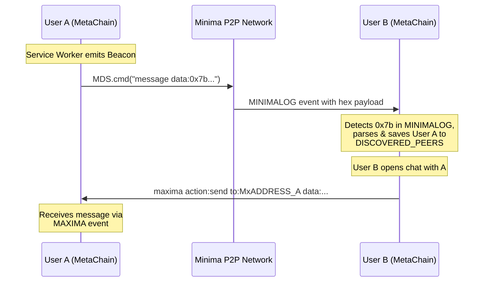

# MetaChain: Decentralized Discovery & Non-Contact Messaging

I have designed MetaChain to be a truly decentralized social experience. This document explains the two technical systems I built on top of Minima to allow users to discover each other and exchange messages **without requiring a prior formal Maxima contact exchange**.

---

## Context: The Maxima Contact Limitation

Minima's Maxima protocol requires that two nodes perform a mutual "Contact" handshake before they can reliably message each other using a `publickey`. This is a security feature, but it creates a UX friction point for a social application: users need to share their contact details out-of-band before they can even say "hello".

I built two systems to solve this:
1.  A **P2P Beacon Protocol** for decentralized identity discovery.
2.  A **Direct Address Messaging** layer that routes messages via Maxima Address (`Mx...`) to bypass the contact check.

---

## 1. The Beacon Discovery System (P2P Broadcast)

### How I Broadcast My Presence

Every few minutes, my DApp's **Service Worker** emits a Beacon—a JSON packet representing the local user—serialized as a Hex string and sent via the low-level `message` command. Crucially, this is **not Maxima**: it is a raw P2P broadcast that propagates through the Minima network overlay (gossip) and is received by all connected peers, regardless of contact status.

The Beacon payload contains:
- `pubkey`: Maxima public key
- `address`: Maxima address (`Mx...`) for direct messaging
- `alias`, `bio`, `avatar`: Display information
- `allowNonContactChats`: User-controlled permission flag

**Emission Code ([beacon.handler.js](file:///home/joanramon/Minima/metachain/public/service-workers/handlers/beacon.handler.js)):**
```javascript
const beacon = {
    app: "metachain",
    type: "BEACON",
    pubkey: myPk,
    alias: myAlias,
    address: myMxAddress, // The 'Mx...' address, used for direct messaging later
    allowNonContactChats: true,
    timestamp: Date.now()
};

const hexData = "0x" + utf8ToHex(JSON.stringify(beacon)).toUpperCase();

// Broadcast to the entire P2P network (NOT Maxima messaging)
MDS.cmd("message data:" + hexData);
```

### How I Discover Other Nodes

I capture these broadcasts by listening to the `MINIMALOG` event in my Service Worker. Minima logs all low-level P2P messages through this channel. I filter for the Hex prefix `0x7b` (which is the `{` character in UTF-8, signaling a JSON object) and then parse and validate the content.

**Discovery Code ([main.js](file:///home/joanramon/Minima/metachain/public/service-workers/main.js)):**
```javascript
MDS.init((msg) => {
    if (msg.event === "MINIMALOG") {
        const logMsg = msg.data.message;

        // Filter for raw hex data that looks like a JSON object
        if (logMsg.toLowerCase().indexOf("0x7b") !== -1) {
            try {
                const beacon = JSON.parse(hexToUtf8Simple(extractHex(logMsg)));

                // Only process payloads tagged as MetaChain beacons
                if (beacon.app === "metachain" && beacon.type === "BEACON") {
                    handleBeacon(beacon, 'P2P'); // Saves peer to DISCOVERED_PEERS table
                }
            } catch (e) { /* Silently skip non-MetaChain payloads */ }
        }
    }
});
```

### Local Peer Registry

When a beacon is validated, I persist it to a local SQL table called `DISCOVERED_PEERS` using a `MERGE` (upsert) statement. This acts as a local "phonebook" of recently seen users.

```sql
MERGE INTO DISCOVERED_PEERS (publickey, alias, address, last_seen, allow_non_contact_chats, ...)
KEY (publickey)
VALUES ('...', '...', 'Mx...', 1740000000, 1, ...)
```

---

## 2. Non-Contact Messaging (Direct Maxima Addressing)

### The Key Insight: `to:` vs `publickey:`

The Maxima [send](file:///home/joanramon/Minima/metachain/src/services/minima.service.ts#1166-1169) command supports two routing modes:
- `publickey:` → Requires a pre-established Contact handshake. Fails with *"No Contact found"* otherwise.
- `to:` → Accepts a full `Mx...` address directly, **bypassing the contact check entirely**.

I exploit this distinction. Since I have the recipient's `Mx...` address stored in `DISCOVERED_PEERS` from their Beacon, I can initiate a message to them without any prior handshake.

**Sending Logic ([messaging.service.ts](file:///home/joanramon/Minima/metachain/src/services/messaging.service.ts)):**
```typescript
const sendParams = {
    action: "send",
    application: "metachain",
    data: hexData,
    poll: true, // Ensures delivery even if the peer is temporarily offline
};

// If I have an Mx address → use 'to:' to bypass the contact check
if (toAddress.startsWith("Mx")) {
    sendParams.to = cleanMaximaAddress(toAddress);
} else {
    // Fallback for established contacts, uses the standard publickey route
    sendParams.publickey = toAddress;
}

await MDS.cmd.maxima({ params: sendParams });
```

### Automatic Fallback Resolution

If an initial send attempt fails with `"No Contact found"` (e.g., the app tried the `publickey` route), my code automatically performs a fallback lookup in `DISCOVERED_PEERS` and retries using the `to:` route.

```typescript
if (errorMessage.includes("No Contact found")) {
    const peerRes = await runSQL(
        `SELECT ADDRESS FROM DISCOVERED_PEERS WHERE PUBLICKEY='${safeKey}' LIMIT 1`
    );

    if (peerRes.rows.length > 0) {
        const mxAddress = peerRes.rows[0].ADDRESS;
        // Retry using Direct Addressing, bypassing the contact check
        await MDS.cmd.maxima({
            params: { action: "send", to: mxAddress, data: hexData, poll: true }
        });
    }
}
```

---

## End-to-End Flow



---

## Summary

By separating the **Discovery Layer** (P2P `message` + `MINIMALOG`) from the **Interaction Layer** (Maxima `to:Mx...`), I have built a system where:
- Any user can **broadcast** their presence to the whole network without needing contacts.
- Any user can **receive a first message** from a stranger without a prior handshake.
- The system degrades gracefully: if a direct `Mx` address is unavailable, it falls back to the standard `publickey` contact route.
